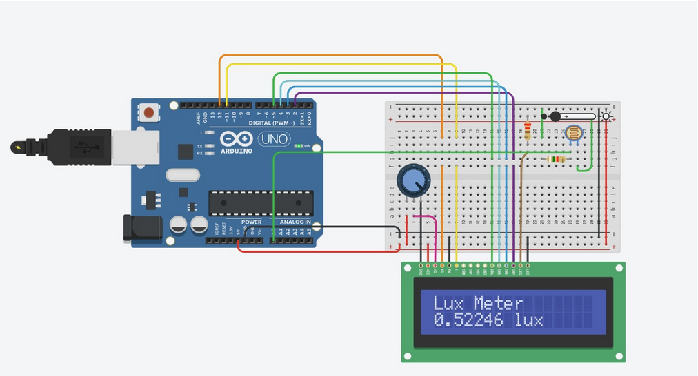

# Light intensity sensor (luxmeter) using arduino and LDR.
## **[To see Data sheet click here.](https://www.scribd.com/doc/128939598/LDR-Datasheet)**
## Hardware requirments:
<ol>
  <li>LDR </li>
  <li>Arduino Uno board + cable. </li>
  <li>16x2 LCD for displaying output. </li>
  <li>I2C chip for interfacing with the LCD. </li>
  <li>Fixed 10 KOhm resistor. (meausred at 9470 ohms, yours could vary.) </li>
  <li>A long wire to connect to the sensor.</li>
  <li>Some jumper cables.</li>
  <li>Battery pack + USB cable (in case you need to make it wearable.)</li>
  <li>A sick pair of sunglasses. (optional)</li>
</ol>

## Summary
(code is in the "light_intensity_sensor" file)
The main goal of the project is to make a light intensity sensor (that measures in lux) aka a luxmeter.

## Circuit Diagram

## Prototype photos

here we see the Prototype, note the buzzer and Lcd for displaying the warnings.

The LDR is strapped (neatly) to my sunglasses, and if the light intensity in the room were to increase (for example, someone shines a flashlight directly to my eyeballs.) there will be a sound telling me this room is too bright and I should do something about it.

## Code parts
### What the code does:
1. Measure the voltage /resistance across the LDR

3. Calculate the light intensity on the sensor in lux.
4. Make a Buzzing sound when the intensity gets too high.

### Measuring the resistance of the LDR.

The method I'm using to measure the LDR is the voltage divider, we connect a 5v
source and a series resistor to the LDR, then we place an analog pin under the LDR
to measure its voltage and calculate the voltage, (which is ldrVoltage in the code.)
see below for more details.     

this is meant to demonstrate the concept of analog voltage measurement, in the actual circuit however, I've switched up the places of the resistors, I'm also using an LDR instead of an FSR, the same ideas apply. 

### Calculating the light intensity based on the resistance.
I'm not gonna lie and say that I calibrated the sensor and found a mathematical relationship between the resistance and the light intensity, then found a way to convert that value into lux, I just happened to find someone using a very similar sensor to The one I'm using, If you wanna do the above steps for a different sensor, **[here's the link I found it at](https://www.allaboutcircuits.com/projects/design-a-luxmeter-using-a-light-dependent-resistor/)**. If you're interested in recreating this project using a different sensor you should follow this tutorial.

You can also use an app from the play store instead of the digital light meter (for calibration purposes.)

## (Potential) Future work
1. Actually calibrating the sensor that I Have
2. Adding more practical methods for alarm (a vibration motor)
3. Making a video tutorial about it.

I hope this tutorial was helpful, if you kept reading this far I would like to say "Have a nice day."
